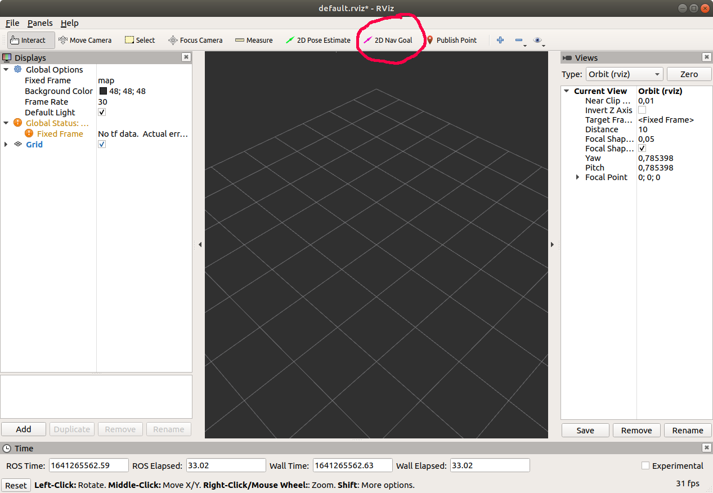

## Step1: Initializing the Ohmnilabs and Xavier NX
1. Power up the Ohmnilabs, Xavier NX and wait until they completely finish initializing (about a minute).
2. On Ubuntu PC, open Terminator and split it into subwindows ("ctrl+shift+o" to split vertical, and "ctrl+shift+e" to split horizon):
.  
- The first subwindow, type "connect" to connect to Ohmnilabs
- The 2nd subwindow, type "start_docker" to run the docker and wait for few seconds before moving on another step. This is done ONLY ONCE after booting up the robot.
- The 3rd subwindow, type "web" to run the web service. Open the web browser to address: http://localhost (on PC), or http://pc_ipaddress on other device.
- The 4th subwindow, type "run_nx" to start Xavier NX facemask detection. We should make sure that Xavier NX has already POWERED ON. If we want to stop Xavier NX, just type "stop_nx" and POWER OFF the system.

## Step2: Checking robot status
### - Checking web service
If all connections are good, the web interface should be like the below image:   
.  

In case there is an issue, everything is in YELLOW color. We need to make sure that Ohmnilabs has initialized properly (follow Step1). Another case can cause the issue is the IP address of Ohmnilabs has changed. Modify the IP address of Ohmnilabs in file: /var/www/webs/bashrc: export ROS_MASTER_URI=http://192.168.0.102:11311.  

In file /var/www/webs/common.js, we make sure ip_addr of this line :ws_address: 'ws://ip_addr:9090' is correct.
### - Checking lidar
If the lidar operate normaly, we should be able to see the points on the web at ViewMap tab. If there is the issue, we restart the lidar node in  Setting tab on the web.
  
### - Switching between Ohmni Mode and ROS Mode
Right after the web is in service, we should select one of the modes in order to stablize the Robot.

## Step3: Building MAP
1. Choose the appropriate starting position for the robot. It is IMPORTANT because this position will be considered as the coordinate Origin. The robot orientation should be perpendicular with the wall. For example:

This position should be marked or highlighted!

2. On Ubuntu PC, open Terminator and type "buildmap":

Then, use "2D Nav Goal" button on the Rviz interface and set goal for the robot to move around until the map is completely built. 
NOTE: After map is built, do not turn off the terminator until the map is saved.

## Step4: Saving MAP
Open another Terminator and type "savemap"

Optional: Set goal for the robot to back to the Origin position or the vicinity of the Origin so that the robot orientation nearly coincides with that of the Origin. If the robot is at this position before running the Step5, setting initial pose for the robot is not necessarry!

## Step5: Running the Robot
Terminate the terminator running buildmap function. Then, type "runrobot":

If the robot is not at the Origin, setting initial pose step is required. Based on the actual position of the robot on the map, use 2D pose Estimate button on Rviz interface to set the initial pose for the robot. (this step can be skiped if the robot is at the Origin before runrobot)

## Step6: Zone selection
Use 2D Nav Goal button on Rviz to set goal for the robot to move to suitable positions. When the robot stays at the desired position, press the button Home, Showroom, ZoneA, ZoneB, or ZoneC to set the desired coordinates for these positions.
If all positions are set, now the robot can fully operate all the function!
